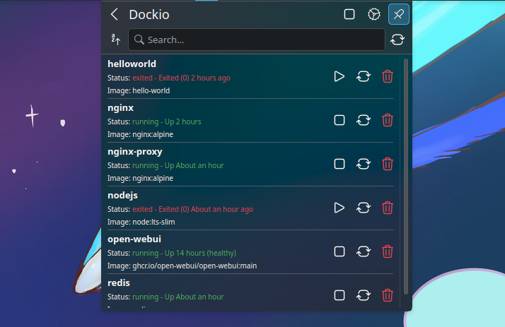
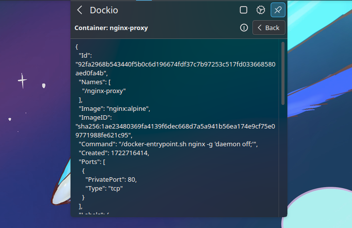

# Dockio

Control your docker containers from plasma applet.

> [!NOTE]
> To use the plasmoid widget effectively, it is essential to run Docker without requiring sudo privileges.

## Features

- [X] Start / Stop Docker from applet
- [X] List all available containers
- [X] Start, Stop, Restart and Delete containers
- [X] Show containers info
- [X] Inspect containers
- [X] Container logs shortcut
- [X] Exec container shortcut
- [ ] Remote Docker (To do)

## Screenshots




## Package Dependencies

### Arch

```bash
sudo pacman -S curl kdeplasma-addons
```

## Installation

### KDE Store (Recommended)

[Store link](https://store.kde.org/p/2185626)

1. Right click on the desktop
2. Click on "Enter Edit Mode"
3. Click on "Add Widgets"
4. Click on "Get New Widgets"
5. Click on "Download New Plasma Widgets"
6. Search for "Dockio"
7. Click on "Install" and you're done!

Go to Configure System Tray > Entries > System Services then choose "Show when relevant" or "Always shown"

### Build it Yourself

```bash
git clone https://github.com/imoize/plasmoid-dockio.git
cd plasmoid-dockio
kpackagetool6 -t Plasma/Applet -i package
```

Restart plasmashell
```bash
systemctl --user restart plasma-plasmashell
```

Go to Configure System Tray > Entries > System Services then choose "Show when relevant" or "Always shown"

### Run Docker without sudo privileges

To utilize the plasmoid widget for managing Docker containers, it's essential to run Docker without requiring sudo privileges. This ensures that the functionality works as expected. See [here](https://docs.docker.com/engine/install/linux-postinstall/) for detailed information.

Create the docker group.
```bash
sudo groupadd docker
```

Add your user to the docker group.
```bash
sudo usermod -aG docker $USER
```

Log out and log back in so that your group membership is re-evaluated.